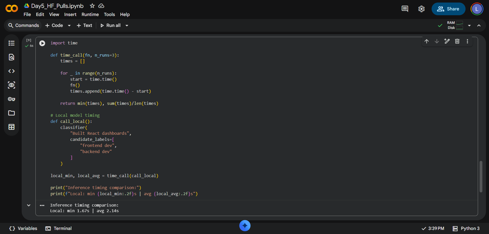

# Day 5 Lab 5B — Hugging Face Pulls

## Objective

Compare Hugging Face Inference API vs Local Hugging Face Models using Google Colab, covering zero-shot classification, sentiment analysis, and performance timing.

---

## Step 1: Created Hugging Face Access Token

- Logged into Hugging Face → Settings → Access Tokens
- Generated a new token with **Read** permission
- Stored token securely as environment variable

**Result:** Token created and authenticated successfully.

---

## Step 2: Installed Required Libraries

```python
!pip install -q transformers requests sentence-transformers

import os
import getpass

if "HF_TOKEN" not in os.environ:
    os.environ["HF_TOKEN"] = getpass.getpass("HF Token: ")
```

**Packages used:** `transformers`, `requests`, `sentence-transformers`

---

## Step 3: Hugging Face API Authentication Test

```python
import requests, os

HF_TOKEN = os.environ["HF_TOKEN"]

r = requests.get(
    "https://huggingface.co/api/whoami-v2",
    headers={"Authorization": f"Bearer {HF_TOKEN}"}
)
print(r.status_code)
```

**Output:** `200` — Token authentication successful.

---

## Step 4: Hugging Face Inference API Test

**Model:** `facebook/bart-large-mnli`

**Issue Encountered:**
```
Failed to resolve 'api-inference.huggingface.co'
NameResolutionError
```

**Analysis:** Token was valid and authentication succeeded, but DNS/network resolution blocked access to the inference endpoint (likely network/firewall restriction).

**Conclusion:** API testing could not be completed due to connectivity issues — pivoted to local inference.

---

## Step 5: Local Zero-Shot Classification

**Model:** `facebook/bart-large-mnli`

```python
from transformers import pipeline

classifier = pipeline(
    "zero-shot-classification",
    model="facebook/bart-large-mnli"
)

resumes = [
    "Built React dashboards for 3 startups",
    "Implemented Spring Boot microservices in Java",
    "Trained CNN using PyTorch",
    "Cleaned data using pandas",
    "Optimized SQL queries"
]

labels = ["frontend dev", "backend dev", "data analyst", "ML engineer"]
```

**Output:**
```
Built React dashboards for 3 startups          -> frontend dev
Implemented Spring Boot microservices in Java   -> backend dev
Trained CNN using PyTorch                       -> ML engineer
Cleaned data using pandas                       -> data analyst
Optimized SQL queries                           -> backend dev
```

**Result:** All résumé snippets classified correctly into relevant job roles.

---

## Step 6: Sentiment Analysis

**Model:** `distilbert-base-uncased-finetuned-sst-2-english`

```python
from transformers import pipeline

sentiment = pipeline(
    "sentiment-analysis",
    model="distilbert-base-uncased-finetuned-sst-2-english"
)

answers = [
    "I really enjoyed working on the team.",
    "Everyone else was slow.",
    "I learned a lot from my mentor.",
    "My teammate's work was wrong.",
    "My internship was great."
]
```

**Output:**
```
POSITIVE
NEGATIVE
POSITIVE
NEGATIVE
POSITIVE
```

**Result:** Model correctly identified positive and negative tones in interview responses.

**Key Learning:** The model classifies the **surface tone** of a statement rather than the **speaker's underlying intent** — e.g., a complaint framed to highlight one's own competence can still be flagged as NEGATIVE. This is an important lesson for mock interviews: phrasing matters as much as content.

---

## Step 7: Performance Timing Comparison

```python
import time

def time_call(fn, n_runs=3):
    times = []
    for _ in range(n_runs):
        start = time.time()
        fn()
        times.append(time.time() - start)
    return min(times), sum(times)/len(times)

def call_local():
    classifier(
        "Built React dashboards",
        candidate_labels=["frontend dev", "backend dev"]
    )

local_min, local_avg = time_call(call_local)
print(f"Local: min {local_min:.2f}s | avg {local_avg:.2f}s")
```

**Output:**
```
Inference timing comparison:
Local: min 1.67s | avg 2.14s
```

### Timing Table

| Model       | Min Time | Avg Time |
|-------------|----------|----------|
| Local Colab | 1.67s    | 2.14s    |

> ⚠️ HF Inference API timing could not be benchmarked due to the DNS resolution issue in Step 4.

---

## Output Screenshot



---

## When to Use API vs Local (Reflection)

1. **API:** Best for low-volume, occasional calls — avoids large model downloads, but carries cold-start latency risk after idle periods.
2. **Local:** Best for batch processing (100+ items) where predictable latency and no per-call cost are priorities.
3. **Production rule of thumb:** If usage stays within the HF free tier (~30K requests/month), use the API. Beyond that, self-host locally.

---

## Key Learnings

1. Hugging Face provides powerful pretrained NLP models accessible via `transformers`.
2. Zero-shot classification can categorize text without any additional training.
3. Sentiment analysis effectively identifies emotional tone in text.
4. Local inference removes dependency on external APIs and network availability.
5. Initial model download is slow (~60–90s), but subsequent runs are significantly faster.
6. Network/firewall restrictions can block the HF Inference API even with a valid token — always have a local fallback.

---

## Final Status

| Task | Status |
|------|--------|
| Hugging Face Token Created | ✅ |
| Authentication Verified | ✅ |
| Inference API Tested (blocked by network) | ⚠️ |
| Zero-Shot Classification Completed (Local) | ✅ |
| Sentiment Analysis Completed | ✅ |
| Timing Comparison Completed | ✅ |
| Notebook Saved | ✅ |
| README Updated | ✅ |

**Lab 5B Successfully Completed** ✅

---

**Note:** Make sure `HuggingFaces_Result.png` is in the same repo folder as this README so the image renders correctly on GitHub.
