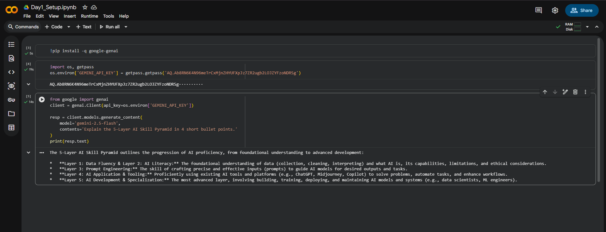

# 🚀 AI Mentor Bootcamp — Lakshmi Prasanna Duvvu


> 🎯 Public portfolio of **12-Day AI Trainer Bootcamp** — documenting hands-on AI skills,
> tools, and projects built from scratch. By Day 12: 6 daily notebooks + capstone Streamlit app.

---

## 👩‍💻 About Me

| Field | Details |
|-------|---------|
| 👤 Name | Lakshmi Prasanna Duvvu |
| 🎓 Role | AI Mentor Trainee |
| 🛠️ Bootcamp | 12-Day AI Trainer Workshop |
| 📍 GitHub | [@DuvvuLakshmiPrasanna](https://github.com/DuvvuLakshmiPrasanna) |

---

## 📅 Bootcamp Progress

| Day | Lab | Topic | Notebook | Status |
|-----|-----|-------|----------|--------|
| Day 1 | Lab 1B | Toolkit Setup + Hello Gemini | [Day1_Setup.ipynb](Day1_Setup.ipynb) | ✅ Done |
| Day 2 | — | Coming Soon | — | 🔜 |
| Day 3 | — | Coming Soon | — | 🔜 |
| Day 4 | — | Coming Soon | — | 🔜 |
| Day 5 | — | Coming Soon | — | 🔜 |
| Day 6 | — | Coming Soon | — | 🔜 |
| Day 12 | Capstone | Streamlit App | — | 🔜 |

---

## ✅ Day 1 — Toolkit Setup (Lab 1B)

### 🎯 Objectives
- Provision Google AI Studio (Gemini) API key
- Provision Groq API key
- Create public GitHub portfolio repo
- Run first Gemini API call in Google Colab
- Push notebook to GitHub

### 🔧 Tools Used

| Tool | Purpose | Status |
|------|---------|--------|
| 🧠 Google AI Studio | Gemini API Key | ✅ |
| ⚡ Groq | Fast LLM Inference Key | ✅ |
| 📓 Google Colab | Notebook Environment | ✅ |
| 🐙 GitHub | Portfolio & Version Control | ✅ |

### 📋 Acceptance Checklist

- ✅ Google AI Studio API key provisioned
- ✅ Groq API key provisioned
- ✅ Public GitHub repo created
- ✅ `Day1_Setup.ipynb` committed and renders on GitHub
- ✅ Hello-Gemini API call working
- ✅ Screenshot of working output in README

### 🔗 Notebook
👉 [Day1_Setup.ipynb](Day1_Setup.ipynb)

### 💻 Code Used

**Install Library:**
```python
!pip install -q google-genai
```

**Secure API Key Input:**
```python
import os, getpass
os.environ['GEMINI_API_KEY'] = getpass.getpass('Paste your Google AI Studio key: ')
```

**First Gemini API Call:**
```python
from google import genai
client = genai.Client(api_key=os.environ['GEMINI_API_KEY'])

resp = client.models.generate_content(
    model='gemini-2.5-flash',
    contents='Explain the 5-Layer AI Skill Pyramid in 4 short bullet points.'
)
print(resp.text)
```

### 🖼️ Gemini First Call — Output Screenshot



---

## 🛠️ Tech Stack

| Technology | Usage |
|-----------|-------|
| 🧠 Google Gemini 2.5 Flash | LLM API calls |
| ⚡ Groq | Fast inference |
| 📓 Google Colab | Notebook environment |
| 🐍 Python | Programming language |
| 🐙 GitHub | Version control & portfolio |
| 🚀 Streamlit | Capstone app (Day 12) |

---

## 🔐 Security Practices

- ✅ API keys stored in password manager
- ✅ Keys entered via `getpass()` — never hardcoded
- ✅ No secrets committed to GitHub
- ✅ Public repo contains zero sensitive data

---

## 📈 Key Learnings — Day 1

- LLM responses are **non-deterministic** — same prompt gives different outputs each run
- `getpass()` is critical for **API key security** in public notebooks
- Gemini 2.5 Flash is fast and capable for summarisation tasks
- Always **revoke and regenerate** exposed API keys immediately

---

## 🔗 Related Repositories

| Repo | Description |
|------|-------------|
| [4-Tool-AI-Comparison-Matrix-Lab-1A](https://github.com/DuvvuLakshmiPrasanna/4-Tool-AI-Comparison-Matrix-Lab-1A) | Lab 1A — AI Tool Comparison |
| [Toolkit-Setup-Lab-1B](https://github.com/DuvvuLakshmiPrasanna/Toolkit-Setup-Lab-1B) | Lab 1B — Toolkit Setup (this repo) |

---

## 📬 Connect With Me

[](https://github.com/DuvvuLakshmiPrasanna)

---

*🤖 Built with curiosity and code during the AI Mentor Bootcamp — 12 days of hands-on AI training.*
